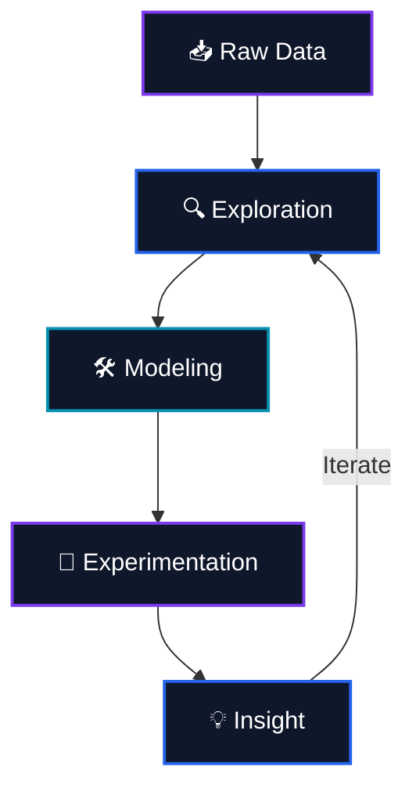

 

  

&nbsp;

  

 

 

## 🧬 About Me

<table>
<tr>
<td width="60%" valign="top">

> 💡 *"Turning messy data into clean insight — one model at a time."*

I'm a **Computer Engineering student** at Islamic Azad University, Shiraz Branch, with a growing focus on **Artificial Intelligence**.

My path so far has taken me through **Machine Learning** and **Data Mining**, and I'm now taking my first steps into **Natural Language Processing** — while also going deeper into **Deep Learning** and **LLMs**.

I like turning theory into working code: exploring datasets, building models, running experiments, and learning from what breaks along the way.

</td>
<td width="40%" valign="top">

 

 

 

 

 

 

</td>
</tr>
</table>

## 🧠 Areas of Focus

<table>
<tr>
<td align="center" width="25%">

🤖

<b>Artificial Intelligence</b> 
Exploring different AI fields to find my specialty
</td>
<td align="center" width="25%">

🧠

<b>Machine Learning</b> 
Building & experimenting with real-world models
</td>
<td align="center" width="25%">

💭

<b>NLP</b> 
Next on my learning roadmap
</td>
<td align="center" width="25%">

⛏️

<b>Data Mining</b> 
Extracting patterns & knowledge from data
</td>
</tr>
</table>

## 🛠️ Tech Stack

**Languages & Core**

  

**Data Science & Machine Learning**

  

**Web Scraping & Data Collection**

## 📊 GitHub Stats

 

## 👨‍🏫 Teaching Experience

<table>
<tr>
<td align="center" width="50%">

### 🌳 Data Structures & Algorithms
**Head Teaching Assistant**
 
Course Design · Problem Sets · Student Mentoring

</td>
<td align="center" width="50%">

### 📊 Data Mining
**Head Teaching Assistant**
 
Technical Guidance · Lab Sessions · Grading

</td>
</tr>
</table>

## 🔭 Currently Exploring

  

## 🧩 My Workflow

### 🐍 Contribution Snake

Made with 💜 by Amir Mohammad Asadjoo

