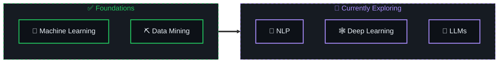

<div align="center">


<br/><br/>

<a href="https://www.linkedin.com/in/amir-mohammd-asadjoo/"></a>
<a href="https://t.me/Khode_ZeUSS"></a>


</div>

<br/>

## 🧬 `whoami`

> *"Turning messy data into clean insight — one model at a time."*

I like turning theory into working code: exploring datasets, building models, running experiments, and learning from whatever breaks along the way.

```python
class AmirMohammad:
    """Computer Engineering student · AI enthusiast · Teaching Assistant"""

    def __init__(self):
        self.university = "Islamic Azad University, Shiraz Branch"
        self.major      = "Computer Engineering"
        self.explored   = ["Machine Learning", "Data Mining"]
        self.learning   = ["Natural Language Processing", "Deep Learning", "LLMs"]
        self.teaching   = ["TA · Data Structures & Algorithms", "TA · Data Mining"]
        self.languages  = ["Python", "C++"]

    def workflow(self):
        return "raw data → exploration → modeling → experiments → insight → repeat"


me = AmirMohammad()
```

## 🗺️ Learning Roadmap


```mermaid
flowchart LR
    subgraph F["✅ Foundations"]
        direction TB
        ML["🧠 Machine Learning"]
        DM["⛏️ Data Mining"]
    end
    subgraph N["🔄 Currently Exploring"]
        direction TB
        NLP["💬 NLP"]
        DL["🕸️ Deep Learning"]
        LLM["🤖 LLMs"]
    end
    F ==> N

    classDef done fill:#0D1117,stroke:#22C55E,stroke-width:2px,color:#E6EDF3
    classDef now fill:#0D1117,stroke:#A78BFA,stroke-width:2px,color:#E6EDF3
    class ML,DM done
    class NLP,DL,LLM now
    style F fill:#161B22,stroke:#22C55E,stroke-dasharray:5 5,color:#22C55E
    style N fill:#161B22,stroke:#A78BFA,stroke-dasharray:5 5,color:#A78BFA
```

## 🛠️ Toolbox

<table>
  <tr>
    <td align="right" width="200"><b>💻 Languages</b></td>
    <td>
      
      
      
      
    </td>
  </tr>
  <tr>
    <td align="right"><b>🧠 Data Science & ML</b></td>
    <td>
      
      
      
      
      
      
    </td>
  </tr>
  <tr>
    <td align="right"><b>🕷️ Data Collection</b></td>
    <td>
      
      
      
    </td>
  </tr>
  <tr>
    <td align="right"><b>⚙️ Tools</b></td>
    <td>
      
      
      
    </td>
  </tr>
</table>

## 👨‍🏫 Teaching

<table>
  <tr>
    <td width="50%" valign="top">

#### 🌳 Data Structures & Algorithms
`Teaching Assistant`

<sub>Problem Sets · Student Mentoring</sub>

</td>
    <td width="50%" valign="top">

#### 📊 Data Mining
`Teaching Assistant`

<sub>Technical Guidance · Lab Sessions · Grading</sub>

</td>
  </tr>
</table>

## 📈 GitHub Activity

<div align="center">


</div>


<div align="center">
<sub>Thanks for stopping by 👋</sub>
</div>
